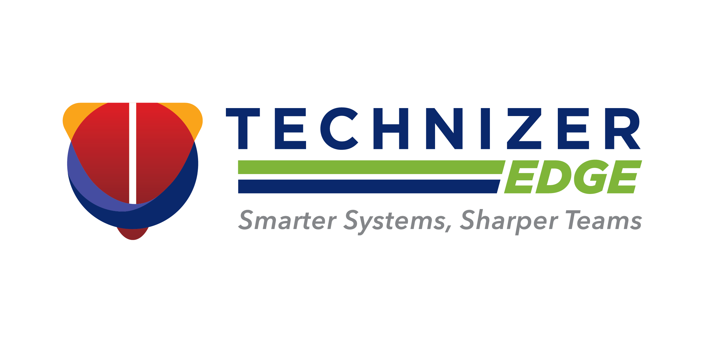

  

  <a href="https://technizeredge.com">Website</a> ·
  <a href="https://aacneo.com">AAC Neo</a> ·
  <a href="mailto:developer@technizeredge.com">Contact</a>

---

We are **Technizer Edge Private Limited**. We build software products, and we build custom software for businesses.

### Products

| Product | What it is |
|---|---|
| **[AAC Neo](https://aacneo.com)** | A web and Android platform with a REST API and an admin console |

### How this organization is organized

- Repositories are named `<product>-<component>`, for example `aac-neo-web`, `aac-neo-mobile` or `aac-neo-docs`.
- Every repository has a product topic (`aac-neo`) and a type topic (`web`, `mobile`, `docs`, `site` or `admin`).
